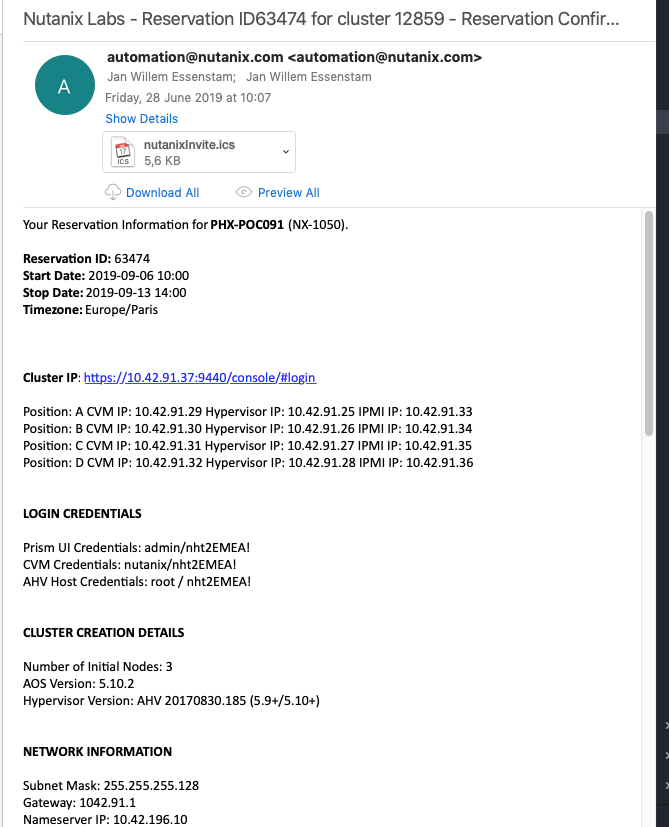
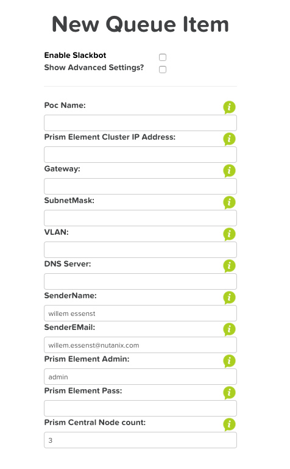

.. _deployment:

----------
Deployment
----------

After a HPOC has been reserved, as discussed during earlier PoC Session, the HPOC cluster(s) is/are empty where only the PRISM interface is available.
To get the cluster(s) ready for demos or even bootcamp/trainings you can use one of two methods to get the cluster(s) prepared.

.. note::
  The mentioned Confluence pages are on VPN accessible only!

1 Click Deployment (1CD)
++++++++++++++++++++++++

The first is using the **1 Click Deployment method**. This method is developed by Michell Grauwmans and can be used to configure and/or install the following:

#. Prism Elements and Prism Central
#. Active Directory server (based on Windows)
#. Karbon
#. Era
#. Files and its Analytics component
#. Flow
#. Self Service Portal
#. X-play
#. X-Ray
#. Move
#. Calm including some blueprints
#. Upload images

This method is capable of using the email that gets sent by the **rx reservation application** to start the deployment of the HPOC cluster.

Just send the received emai to 1-click-demo@nutanix.com  to get the system to start the deployment. It will extract the needed information out of the email and send commands to the HPOC cluster to install the required packages as described earlier.
During the installation phase it uses Slack to update users who have asked for the deployment. It also sends an email that the process is queued and you can make some small changes if you want with respect to the to be installed packages.

If you don't have a received email, or just want your system to be reinstalled after a **Cluster Destroy/Cluster Create** you can also use a manual way of adding your HPOC cluster.

There is also a portable version of this tool available that will be able to run against any cluster that you want to have configured/installed.

Reference
..........

- Confluence page on 1 Click Deployment at https://confluence.eng.nutanix.com:8443/display/SEW/1-Click-Demo.
- Slack channel at **1-click-demo**

Maintainer
..........

- Michell Grauwmans - EMEA

Staging script
++++++++++++++

Since almost a year Mark Lavi has created a script that is capable of installing and configuring the following items:

#. Prism Elements and Prism Central
#. Era
#. Karbon
#. Calm
#. Flow
#. Active Directory Server (based on Linux)
#. X-Play
#. Files and its Analytics component
#. Upload images

The difference with the 1-Click-Deployment is mostly that the script JUST configures/installs the infrastructure. It is mostly used in Bootcamps and trainings as those JUST need the infrastructure.
Another difference is that this method is using a **bash shell** script that needs to be run inside one of the CVMs of the HPOC cluster(s).

To start the staging script, use the command (after logging in into one of the CVMs using SSH)

.. code-block:: bash

  curl --remote-name --location https://raw.githubusercontent.com/nutanixworkshops/stageworkshop/master/bootstrap.sh&& sh ${_##*/}

After starting this command the script will ask for a few parameters it needs to configure/install successfully.

.. images:: images/3.png

Make your selection of the to be installed/configured workshop or bootcamp.  After the last question:\"Do you want to proceed (Y/N)\" the staging process is kicked off.
You can follow the progress using ``tail -f *.log`` on the CVM.

During the running of the script, it send two emails; one from the Prism Elements stage and one email from the Prism Central stage. That way you roughly know where the script is at.

References
..........

- Confluence page on https://confluence.eng.nutanix.com:8443/display/SEW/Bootcamps%3A+Staging+Script
- Slack channel **technology-bootcamps**

Maintainer
..........

- Technical Enablement team - Nathan Cox (USA), Mark Lavi (USA), Willem Essenstam (EMEA)

Workshop
++++++++

This workshop is going to show you how to use the second deployment method using the staging script. Reason for this is that the second day labs (you choose..) are being build on this script.

Login to the Cluster's VIP Address using SSH (use :ref:`cluster_details` for the right IP Addresses). Username **nutanix** and password **nutanix/4u**.

Copy the following command and paste it in ssh session to the CVM and hit **Enter** to start the process

.. code-block:: bash

  curl --remote-name --location https://raw.githubusercontent.com/nutanixworkshops/stageworkshop/master/bootstrap.sh&& sh ${_##*/}

Provide the information asked for and start the script by answering **Y** in the \"question are you sure?\". Follow the process using the ``tail -f *log`` command.

.. note::

  If you have received the email from the cluster you are done for today!! Check your deployment tomorrow to see if it crashed somewhere....

  .. image:: images/4.png
