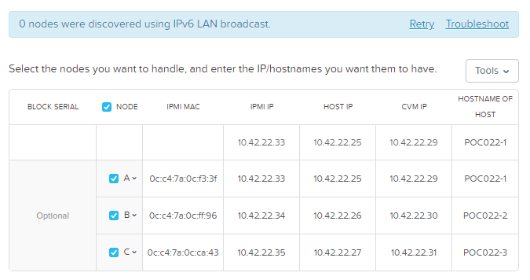
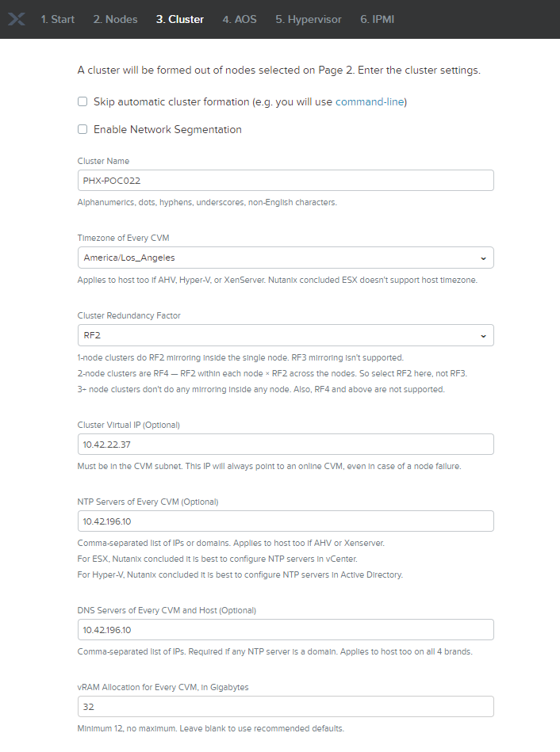

detailed.. role:: html(raw)
   :format: html

.. _foundation_lab_part2:

------------------------
Foundation - Three nodes
------------------------

Overview
++++++++

.. note::

  Estimated time to complete: **60 Minutes**

Foundation is used to automate the installation of the hypervisor and Controller VM on one or more nodes. In this exercise you will practice imaging a physical cluster with Foundation. In order to keep the lab self-contained, you will create a single node "cluster" on which you will deploy your Foundation VM. That Foundation instance will be used to image and create a cluster from the remaining 3 nodes in the Block.

Cluster Details
...............

Using the spreadsheet below, locate your **Group Number** and corresponding details for your assigned cluster.

.. raw:: html

   <iframe src="https://docs.google.com/a/nutanix.com/spreadsheets/d/e/2PACX-1vTohdHcbfSzB65Z1C8d7cAJEmDcZs5DDvUtsXPoezVwdLwOWHipU_Nu8U7ft1DmInKpnAvqWUP_ZfSd/pubhtml?gid=0&amp;single=true&amp;widget=true&amp;headers=false" style="position: relative; height: 400px; width: 98%; border: none"></iframe>

Running Foundation
++++++++++++++++++

Open de PRISM interface on **10.42.XYZ.32**. **XYZ** is mentioned in the spreadsheet.

Goto :fa:`bars` -> **VM** and click one of the Foundation VMs that you want to use as a group. Click on **Launch Console**.

:html:`<strong>From within the Foundation VM console, launch the Nutanix Foundation icon from the desktop. This is important as you will be downloading a large AOS binary file later in the lab. Using your local browser over the VPN will result in a very slow download.</strong>`

.. note::

  Foundation can be accessed via any browser, including your local browser outside of the Foundation VM, at \http://*<Foundation VM IP>*:8000/gui/index.html.

If prompted to upgrade, click **Remind Me Later**.

On the **Start** page, fill out the following fields:

- **Select which network to use for this installer** - eth0
- **Select your hardware platform** - Nutanix
- **Will your production switch do link aggregation?** - No
- **Will your production switch have VLANs** - No
- **Netmask of Every Host and CVM** - 255.255.255.128
- **Gateway of Every Host and CVM** - 10.42.\ *XYZ*\ .1
- **Netmask of Every IPMI** - 255.255.255.128
- **Gateway of Every IPMI** - 10.42.\ *XYZ*\ .1

.. figure:: images/7.png

Click **Next**.

Click **Click here** to manually specify the MAC address of your assigned nodes.

.. note::

  Foundation will automatically discover any hosts in the same IPv6 Link Local broadcast domain that is not already part of a cluster.

  .. figure:: images/7b.png

  When transferring POC assets in the field, it's not uncommon to receive a cluster that wasn't properly destroyed at the conclusion of the previous POC. In this lab, the nodes are already part of existing clusters and will not be discovered.

Fill out the following fields and click **Add Nodes**:

- **Number of Blocks** - 1
- **Nodes per Block** - 3
- Select **I will provide the IPMI MACs**

.. figure:: images/8.png

Using the `Cluster Details`_ spreadsheet, fill out the following fields for **Nodes A, B, and C ONLY** and click **Next**:

.. note::

  Use **Tools > Range Autofill** to quickly specify Node IPs. Specify the first IP in the field at the top of the table to provide enumerated values for the entire column.

- **Node** - *<Node Position>*
- **IPMI MAC** - *<IPMI MAC>*
- **IPMI IP** - *<IPMI IP>*
- **Hypervisor IP** - *<Hypervisor IP>*
- **CVM IP** - *<CVM IP>*
- **Hypervisor Hostname** - *<Hypervisor Hostname>*

Using the `Cluster Details`_ spreadsheet, replace the octet(s) that correspond to your HPOC network, fill out the following fields and click **Next**:

- **Cluster Name** - Test-Cluster

  *Cluster Name is a "friendly" name that can be easily changed post-installation. It is common to create a DNS A record of the Cluster Name that points to the Cluster Virtual IP.*
- **Timezone of Every CVM** - Europe/Amsterdam
- **Cluster Redundancy Factor** - RF2

  *Redundancy Factor 2 requires a minimum of 3 nodes, Redundancy Factor 3 requires a minimum of 5 nodes. Cluster creation during Foundation will fail if the appropriate minimum is not met.*
- **Cluster Virtual IP** - 10.42.\ *XYZ*\ .37

  *Cluster Virtual IP needs to be within the same subnet as the CVM/hypervisor.*
- **NTP Servers of Every CVM** - 10.42.196.10
- **DNS Servers of Every CVM and Host** - 10.42.196.10

  *DNS and NTP servers should be captured as part of install planning with the customer.*

- **vRAM Allocation for Every CVM, in Gigabytes** - 32

  *Refer to AOS Release Notes > Controller VM Memory Configurations for guidance on CVM Memory Allocation.*

.. note::

  If during the selection of the AOS (Step 4) there is no AOS that can be selected, please follow :ref:`adding_files_foundation`

Fill out the following fields and click **Next**:

- **Select a hypervisor installer** - AHV, AHV installer bundled inside the AOS installer

.. figure:: images/17.png

.. note::

  Every AOS release contains a version of AHV bundled with that release.

.. note::

  When selecting an alternate hypervisor (ESXi, Hyper-V, XenServer) you can use this page to upload installation ISO files and, if necessary, modified whitelists.

Select **Fill with Nutanix defaults** from the **Tools** dropdown menu to populate the credentials used to access IPMI on each node.

.. figure:: images/18.png

.. note:: When performing a baremetal Foundation in the field, ensure your laptop will not go to sleep due to inactivity.

Click **Start > Proceed** and continue to monitor Foundation progress through the Foundation web console. Click the **Log** link to view the realtime log output from your node.

.. figure:: images/19.png

Wait till the foundation has finished.. Grab :fa:`coffee`

.. note::
  If you are interested in more detailed information on the progress of the foundation process, open a terminal session on the Foundation server or ssh into it using your favourite ssh client. Use **nutanix** and **nutanix/4u** as credentials. After login; type ``cd /home/nutanix/foundation/log``. When you run the command ``tail -f debug.log`` you will see the overall process *BEFORE* the imaging started. Any encountered issues before the imaging process starts, for example IPMI IP Address setting, can be found in the api.log file in the same location. If the imaging started, run ``tail -f /home/nutanix/foundation/log/last_session/debug.log`` to see all steps taken *DURING* the imaging process of **all nodes**.

  .. figure:: images/22.png

.. figure:: images/20.png

.. note::
  Older session of foundation can be found in ``/home/nutanix/foundation/log/archive``. Every session that has run will be archived here independent fail or success status when finished.

**Close the Foundation VM Console.**

Open \https://*<Cluster Virtual IP>*:9440 in your local browser and log in with the following credentials:

- **Username** - admin
- **Password** - Nutanix/4u

.. figure:: images/21.png

Change the password, accept the EULA, and disable Pulse.
