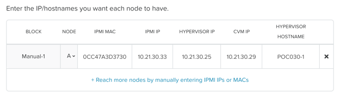
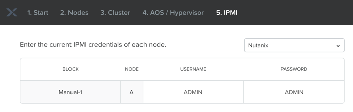
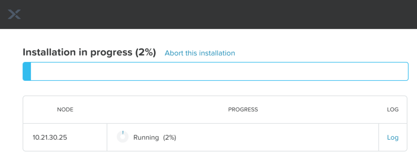

.. _foundation_lab:

------------------------------------------
Single Node Foundation - New Hire Training
------------------------------------------

Overview
++++++++

.. note::

  Estimated time to complete: **90 Minutes**

Foundation is used to automate the installation of the hypervisor and Controller VM on one or more nodes. In this exercise you will deploy a Foundation VM on a shared cluster, configure Foundation, and use it to image a single Nutanix node. Upon successful completion of imaging, you will work as part of a team to form a cluster from the individual nodes.

Documentation and Downloads
...........................

- `Field Installation Guide <https://portal.nutanix.com/#/page/docs/details?targetId=Field-Installation-Guide-v4-0:Field-Installation-Guide-v4-0>`_ - *Comprehensive Foundation documentation, including steps for local deployment of Foundation VM.*
- `Foundation Release Notes <https://portal.nutanix.com/#/page/docs/details?targetId=Field-Installation-Guide-Rls-Notes-v4-0:Field-Installation-Guide-Rls-Notes-v4-0>`_ - *Fixes, known issues, enhancements, and upgrade information.*
- `NX Hardware System Specifications <https://portal.nutanix.com/#/page/docs/list?type=hardware>`_ - *Helpful for determining LAN/IPMI/Shared ports for different hardware platforms.*
- `Foundation binaries and related files <https://portal.nutanix.com/#/page/foundation>`_ - *Downloads for baremetal Foundation, CVM Foundation, and ISO whitelist.*
- `KB2430 <https://portal.nutanix.com/#/page/kbs/details?targetId=kA032000000TT1HCAW>`_ - *Internal Only KB detailing how to download old versions of AOS/AHV that are no longer available on Nutanix Portal.*

Cluster Details
...............

Using the spreadsheet below, locate your **Student Number** and corresponding details for your assigned node.

.. raw:: html

  <iframe src=https://docs.google.com/spreadsheets/d/e/2PACX-1vQyI5rZlI4OQ5KbbUmEYXYRKb7zHvmFGQlqBmFqynNc4BNNlzBvgUamtfIdy2AlGLZYektSupV1_72a/pubhtml?gid=0&amp;single=false&amp;widget=false&amp;chrome=false&amp;headers=false&amp;range=a1:l41 style="position: relative; height: 300px; width: 98%; border: none"></iframe>

Cabling Your Hardware
+++++++++++++++++++++

.. note::

  The following lab will be performed with a cluster in the Nutanix Hosted POC environment. The information on cabling below is for reference when performing a physical, baremetal Nutanix installation.

Foundation requires connectivity to **both** the standard network interface of a node and the Baseboard Management Controller (BMC) network interface. The BMC, called **IPMI** on Nutanix NX nodes, is a dedicated system present in every enterprise server platform used for out of band management. Other supported platforms use different names for IPMI, such as iDRAC on Dell, IMM on Lenovo, and iLO on HPE.

Referring to the example diagram below, there are two options for cabling Nutanix nodes prior to imaging with Foundation:

- Using two cables per node, one connected to either onboard LAN port and one connected to the dedicated IPMI port.
- Using one cable per node, connected to the **Shared IPMI** port. With only the **Shared** port connected, it is capable of intelligently forwarding traffic to either the IPMI or LAN interface, allowing Foundation to communicate with both interfaces simultaneously.

.. figure:: images/back-panel.png

.. note::

  During node power off/on the Shared port on certain platforms may switch between 100Mb and 1Gb speeds, which can cause issues if your switch cannot auto-negotiate to the proper speed.

  Additionally, for nodes such as the NX-3175 which only have 10Gb SFP+ onboard NICs, the 1Gb transceiver used to connect to your flat switch requires electrical power. That power is only available when the node is powered on, making it critical to use two cables per node in this situation.

  Overall, if there are sufficient cables and ports available, using two cables per node is preferred.

Both the nodes and the host used to run the Foundation VM should be connected to the same flat switch. If imaging on a customer switch, ensure that any ports used are configured as **Access** or **Untagged**, or that a **Native** VLAN has been configured.

Refer to the appropriate `manufacturer's hardware documentation <https://portal.nutanix.com/#/page/docs/list?type=hardware>`_ to determine the locations of the **IPMI** and **Shared** ports.

Installing Foundation
+++++++++++++++++++++

Foundation is distributed as a VM image that can be run on multiple platforms, including AHV, VMware ESXi, VMware Workstation/Fusion, and Oracle VirtualBox. When deploying a local instance of the Foundation VM, refer to the `Field Installation Guide <https://portal.nutanix.com/#/page/docs/details?targetId=Field-Installation-Guide-v4-0:Field-Installation-Guide-v4-0>`_ for direction on virtual network configuration. In general, the VM wants to be configured with a **Bridged** network connection and configured with an IP in the same subnet as the planned IP scheme for CVM/hypervisor of the cluster being imaged.

.. note::

  Always use the latest available version of Foundation to image your cluster.

Open https://10.21.22.37:9440 in your browser to access Prism. Log in with the following credentials:

- **Username** - admin
- **Password** - *<Insturctor Provided>*

In **Prism > VM > Table**, click **+ Create VM**.

Using the `Cluster Details`_ spreadsheet, fill out the following fields and click **Save**:

- **Name** - Foundation-*<Student Number>*
- **vCPU(s)** - 2
- **Number of Cores per vCPU** - 1
- **Memory** - 4 GiB
- Select **+ Add New Disk**

  - **Operation** - Clone from Image Service
  - **Image** - Foundation
  - Select **Add**
- Select **Add New NIC**

  - **VLAN Name** - VLAN *<VLAN ID>*
  - Select **Add**

Select your **Foundation-<Student Number>** VM and click **Power on**.

Once the VM has started, click **Launch Console**.

Once the VM has finished booting, click **nutanix**. Enter the default password (**nutanix/4u**) and click **Log In**.

.. figure:: images/1.png

Double-click **set_foundation_ip_address > Run in Terminal**.

Select **Device configuration** and press **Return**.

.. figure:: images/2.png

Select **eth0** and press **Return**.

.. figure:: images/3.png

.. note:: Use the arrow keys to navigate between menu items.

Using the `Cluster Details`_ spreadsheet, fill out the following fields, select **OK** and press **Return**:

- **Use DHCP** - Press **Space** to de-select
- **Static IP** - *<Foundation IP>*
- **Netmask** - 255.255.255.128
- **Gateway** - *<Gateway IP>*

.. figure:: images/4.png

.. note::

  The Foundation VM IP address should be in the same subnet as the target IP range for the CVM/hypervisor of the nodes being imaged. As Foundation is typically performed on a flat switch and not on a production network, the Foundation IP can generally be any IP in the target subnet that doesn't conflict with the CVM/hypervisor/IPMI IP of a targeted node.

Select **Save** and press **Return**.

.. figure:: images/5.png

Select **Save & Quit** and press **Return**.

.. figure:: images/6.png

Close the Foundation VM console.

Running Foundation
++++++++++++++++++

Open \http://*<Foundation VM IP>*:8000/gui/index.html in your browser to access Foundation.

.. note::

  **DO NOT** access the Foundation UI from the Foundation VM console. Close your Foundation VM console and access the Foundation UI via a browser in your Citrix desktop.

Review the **Start** page details as it contains several helpful tips for cabling your physical hardware. Click **Next**.

.. figure:: images/7.png

.. note::

  Foundation will automatically discover any hosts in the same IPv6 Link Local broadcast domain that is not already part of a cluster. When transferring POC assets in the field, it's not uncommon to receive a cluster that wasn't properly destroyed at the conclusion of the previous POC. In this lab, the nodes are already part of existing clusters and will not be discovered.

Click **Click here** to manually specify the MAC address of your assigned node.

.. figure:: images/8.png

Fill out the following fields and click **Add Nodes**:

- **Number of Blocks** - 1
- **Nodes per Block** - 1
- Select **I will provide the IPMI MACs**

.. figure:: images/9.png

Using the `Cluster Details`_ spreadsheet, fill out the following fields and click **Next**:

- **Node** - *<Node Position>*
- **IPMI MAC** - *<IPMI MAC>*
- **IPMI IP** - *<IPMI IP>*
- **Hypervisor IP** - *<Hypervisor IP>*
- **CVM IP** - *<CVM IP>*
- **Hypervisor Hostname** - *<Hypervisor Hostname>*

.. note::

  In addition to the IPMI MAC address labels on the back of each node. Watchtower can be used to collect the IPMI MAC addresses of any NX appliance: *\http://watchtower.corp.nutanix.com/factoryData/<Block Serial>/*

Using the `Cluster Details`_ spreadsheet, fill out the following fields and click **Next**:

- Select **Check this box if you are an advanced user who doesn't want automatic cluster creation**
- **Netmask of Every IPMI** - 255.255.255.128
- **Netmask of Every Hypervisor and CVM** - 255.255.255.128
- **Gateway of Every IPMI** - *<Gateway IP>*
- **Gateway of Every Hypervisor and CVM** - *<Gateway IP>*
- **Memory Allocation of Every CVM** - 32

.. figure:: images/11.png

.. note::

  Refer to **AOS Release Notes > Controller VM Memory Configurations** for guidance on CVM memory allocation based on your specific use case.

.. note::

  In a typical scenario, imaging a cluster with Foundation for a POC, you would want Foundation to automatically create the cluster. The additional fields that are required for Foundation to create the cluster can be referenced in the screenshot below:

  .. figure:: images/12.png

  In this exercise, each team of four will manually create the cluster after imaging their individual nodes with Foundation. Attempting to automatically create the cluster with a single, standard node will fail.

.. note::

  When imaging a cluster with Foundation, the CVMs and hypervisor management IP addresses must be in the same subnet. IPMI IP addresses can be in the same, or different, subnet. If IPMI will not be in the same subnet as CVM/hypervisor, Foundation can be configured to use different IP addresses for IPMI and CVM/hypervisor while on a flat, L2 network. Be careful to avoid duplicate IP address when specifying the **IP of the Interface for the Hypervisor-CVM Subnet**.

  .. figure:: images/13.png

By default, Foundation does not have any AOS or hypervisor images. To upload AOS or hypervisor files, click **Manage AOS Files**.

.. figure:: images/14.png

Click **+ Add > Choose File**. Select ``\\hpoc-afs.nutanixdc.local\iso\Nutanix\AOS\5.6\nutanix_installer_package-release-euphrates-5.6-stable.tar.gz`` and click **Upload**.

.. figure:: images/15.png

After the upload completes, click **Close**.

.. figure:: images/16.png

Fill out the following fields and click **Next**:

- **AOS Installer for Every Node** - nutanix_installer_package-release-euphrates-5.6-stable.tar.gz
- **Hypervisor Installer for Every Node** - AHV, AHV installer bundled inside the AOS installer

.. figure:: images/17.png

.. note::

  Every AOS release contains a version of AHV appropriate for that release.

.. note::

  When selecting an alternate hypervisor (ESXi, Hyper-V, XenServer) you can use this page to upload installation ISO files and, if necessary, modified whitelists.

Fill out the following fields and click **Start > Proceed**:

- **Username** - ADMIN
- **Password** - ADMIN

.. note:: When performing a baremetal Foundation in the field, ensure your laptop will not go to sleep due to inactivity.

Continue to monitor Foundation progress through the Foundation web console. Click the **Log** link to view the realtime log output from your node.

Foundation will leverage IPMI (or the Out of Band Management standard for the given hardware platform, e.g. iDRAC, iLO, CIMC, etc.) to boot each node to a virtual CD image called Phoenix. The Phoenix image contains what are called "Layout Modules." Layout Modules provide critical hardware information to the installer, allowing Nutanix to support a wide range of hardware configurations (NX, Dell, Lenovo, IBM, Cisco, HPE, Klas, Crystal, etc.).

Phoenix will download the AOS and hypervisor binaries from the Foundation VM. Once Phoenix is booted on each node, Phoenix communicates with Foundation via the node's LAN connection. IPMI is only used for mounting the virtual CD image.

Phoenix will then perform an automated installation of the hypervisor (including any packaged drivers) to the appropriate boot media (SATADOM, SD Card, M.2 SSD) and writes the CVM filesystem to a dedicated partition on the first SSD in the system (NOT on the hypervisor boot media).

After these tasks are completed, the node reboots to the newly installed hypervisor. The hypervisor iterates through the SSDs to find out which SSD has the CVM, and then boots the CVM. Firstboot scripts are run to prepare the hypervisor and CVM on the node, including setting IP information.

When all CVMs are ready, Foundation initiates the cluster creation process.

.. note::

  In this lab Foundation will not automatically create the cluster due to only a single node being selected. Proceed to the following section to complete cluster creation.

Creating the Cluster
++++++++++++++++++++

.. note::

  Due to resource constraints you'll need to work in teams of 4 to create a cluster from the 4 nodes individually imaged within each block.

Upon completion of imaging all nodes within a block, elect a single participant within your block to create the cluster.

Using an SSH client, connect to the *CVM IP* for *Node A* in your assigned block using the following credentials:

- **Username** - nutanix
- **Password** - nutanix/4u

Using the `Cluster Details`_ spreadsheet, execute the following to manually create the cluster:

.. code-block:: bash

  cluster --cluster_name=<CLUSTER NAME> --redundancy_factor=2 --cluster_external_ip=<CLUSTER IP> --dns_servers=10.21.253.10 --ntp_servers=10.21.253.10 --svm_ips=<NODE A CVM IP>,<NODE B CVM IP>,<NODE C CVM IP>,<NODE D CVM IP> create

When cluster creation completes, all CVM services should display as **UP**. Execute the following tp configure the timezone for the Nutanix cluster:

.. code-block:: bash

  ncli cluster set-timezone timezone=America/Los_Angeles

Open \https://*<Cluster IP>*:9440 in your browser to validate Prism is available. Log in as the *admin* user.
