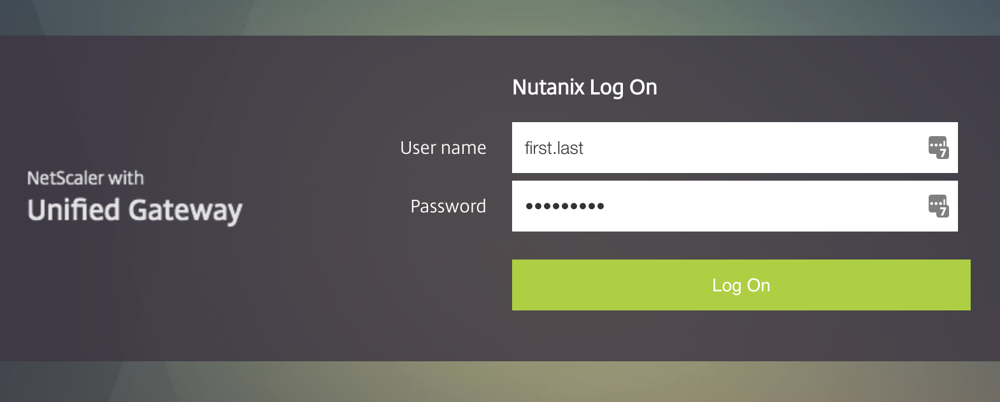
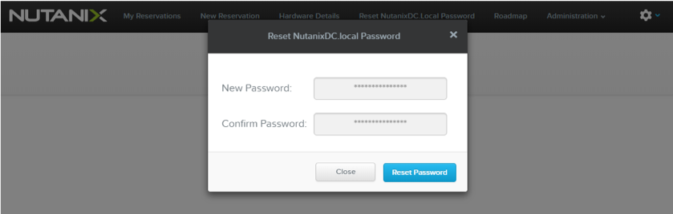
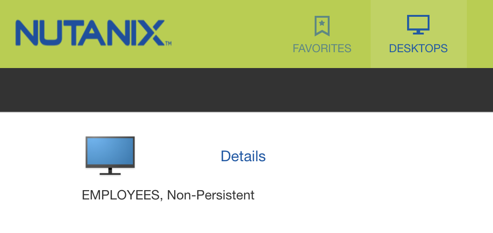

.. title:: Nutanix New Hire Training

.. toctree::
  :maxdepth: 2
  :caption: NHT Group Labs
  :name: _labs
  :hidden:

  groupfoundation/foundation
  xray/xray
  ncc/ncc

.. toctree::
  :maxdepth: 2
  :caption: Practice Labs
  :name: _labs
  :hidden:

  diyfoundation/diyfoundation

.. _getting_started:

Getting Started
===============

.. raw:: html

  <strong>Do not start any labs before being told to do so by your
  instructor.</strong>  

Welcome to Nutanix New Hire Training! Carefully review the **Overview** section of each lab before proceeding with the exercise.

HPOC XenDesktop Access
++++++++++++++++++++++

.. raw:: html

  <strong>The Foundation lab requires uploading a large file (AOS binary) to your Foundation VM, for this reason you NEED to connect to the environment using a virtual desktop.</strong>  

.. note::

  If you are attending NHT and in a non-SE role (e.g. CSM, Services) you DO NOT have NUTANIXDC.local credentials. Alternate credentials will be provided in class to access the HPOC XenDesktop environment.

In your browser, log in at https://citrixready.nutanix.com with your **NUTANIXDC.local** credentials. This username should match your Corp AD (Okta) username (first.last).

The default password is **welcome123** . You will be prompted to change your password.

If the default password fails, you can reset your **NUTANIXDC.local** account password by logging into https://rx.corp.nutanix.com/ (using Okta credentials) and clicking **Reset NutanixDC.Local Password** in the toolbar.

If logon still fails (and you are an SE), contact hostedpoc@nutanix.com to request a **NUTANIXDC.local** account.

Once logged in to https://citrixready.nutanix.com, select **Desktops** from the toolbar and then launch the **EMPLOYEES** desktop.

If the Citrix client isn't immediately launched, your browser may have downloaded a **.ica** file without opening it. Open the **.ica** file to launch the Citrix client.

If you receive a certificate error attempting to connect to your Citrix desktop, download and install the `DigiCert SHA2 Secure Server CA <https://dl.cacerts.digicert.com/DigiCertSHA2SecureServerCA.crt>`_ certificate. Restart your browser and attempt to launch your Citrix desktop again.

**You can now proceed with the :ref:`groupfoundation_lab` lab.**
