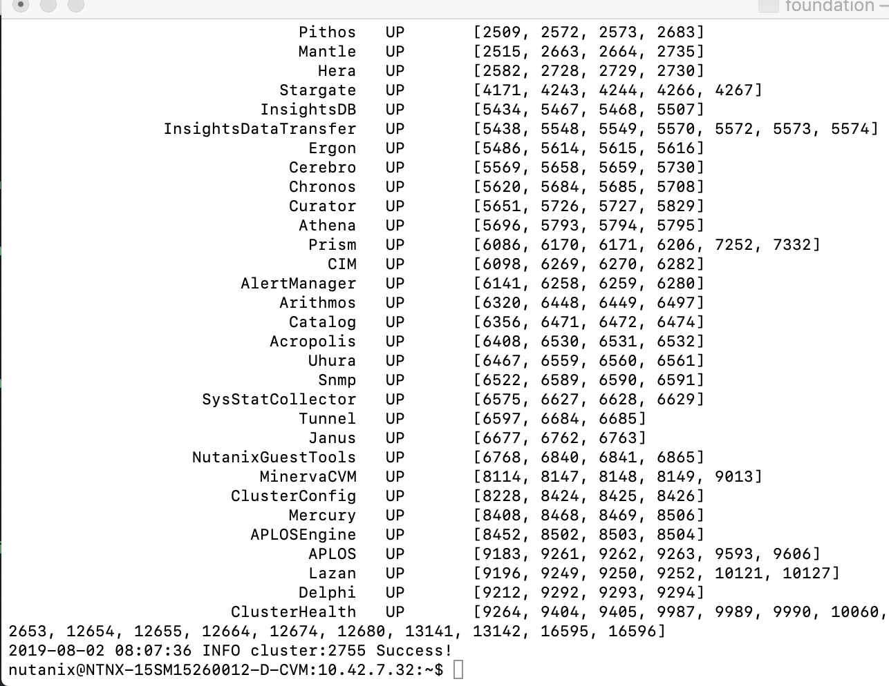

.. _setup_cluster:

-----------------
Setup the cluster
-----------------

Creating the Cluster
++++++++++++++++++++

Upon completion of the Foundation process, open a ssh connection to the node you just "re-imaged".
You can use the **terminal** program on Mac and Linux or use **putty** for Windows machines.

.. note::
  To download Putty, click `here <https://www.chiark.greenend.org.uk/~sgtatham/putty/latest.html>`_.

Use the following credentials to login to the node's CVM:

- **Username** - nutanix
- **Password** - nutanix/4u

Using the :ref:`cluster_details` spreadsheet, execute the following to manually create the cluster:

.. code-block:: bash

  cluster --cluster_name=<CLUSTER NAME> --redundancy_factor=2 --cluster_external_ip=<CLUSTER IP> --dns_servers=10.21.253.10 --ntp_servers=10.21.253.10 --svm_ips=<NODE A CVM IP> create

This command will:

#. Set the name of the cluster
#. use RF 2
#. Assign the external VIP
#. Set the DNS server
#. Set the NTP server
#. Create the cluster

When cluster creation completes, all CVM services should display as **UP**.

Execute the following to configure the timezone for the Nutanix cluster:

.. code-block:: bash

  ncli cluster set-timezone timezone=Europe/Amsterdam

Open \https://*<Cluster IP>*:9440 in your browser to validate Prism is available. Log in as the *admin* user.

.. note::

  As the cluster has just been created, all login values have been reseted to the default ones. This means that the password for the admin account has been reseted to **Nutanix/4u**!!

Change the password to a self chosen one and login using that new password. Accept the EULA by filling in the requested fields.
Disable Pulse and accept the warning message that will appear.

You should now see your "own" cluster where we will run some test against.
