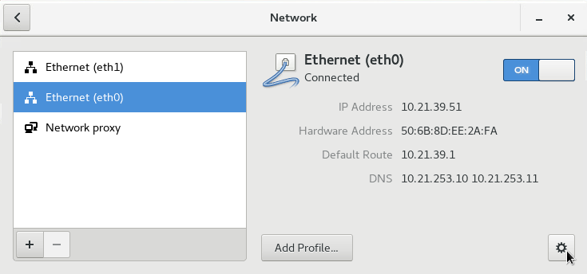
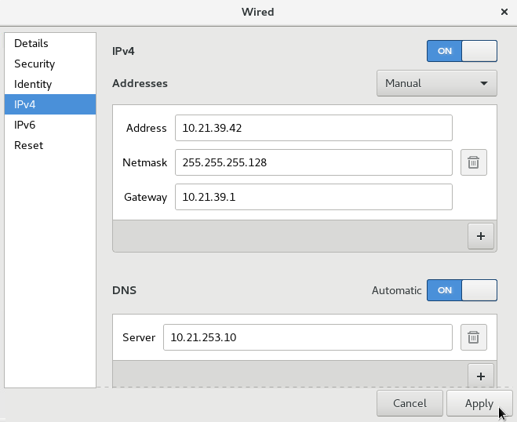
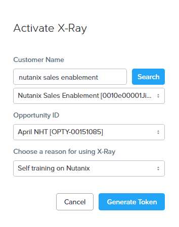
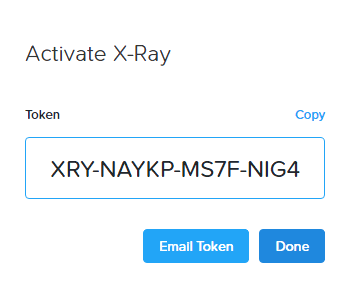
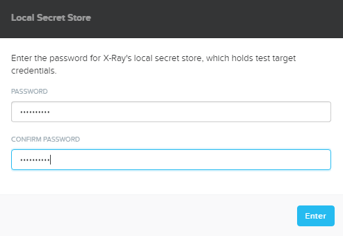
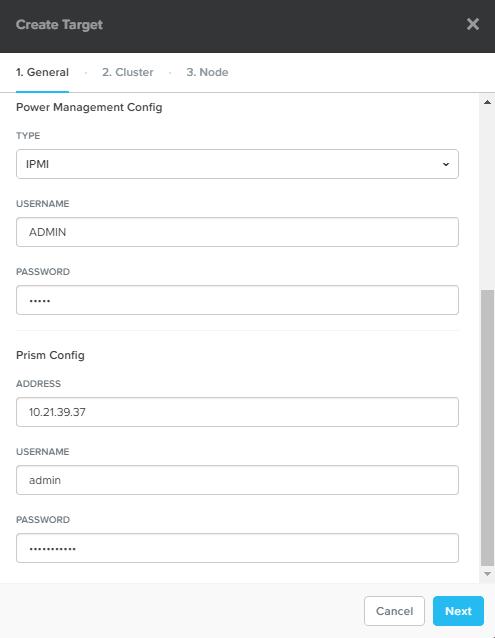
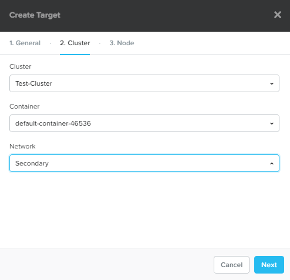
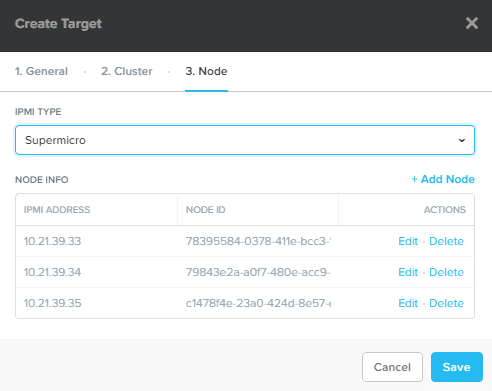

.. _groupxray_lab:

---------------------------------
New Hire Training Group X-Ray Lab
---------------------------------

Overview
++++++++

.. note::

  Estimated time to complete: **90 Minutes**

Foundation is used to automate the installation of the hypervisor and Controller VM on one or more nodes. In this exercise you will practice imaging a physical cluster with Foundation. In order to keep the lab self-contained, you will create a single node "cluster" on which you will deploy your Foundation VM. That Foundation instance will be used to image and create a cluster from the remaining 3 nodes in the Block.

Cluster Details
...............

Using the spreadsheet below, locate your **Group Number** and corresponding details for your group's assigned cluster.

.. raw:: html

  <iframe src=https://docs.google.com/spreadsheets/d/e/2PACX-1vTLL88KnmhLSlNb0cxEUEr5nJCDd09ZqGk8aSMBFYUl-jWfjqjY9j7sjwSWKEv34GXkzzvLNAHqqcZW/pubhtml?gid=0&amp;single=false&amp;widget=false&amp;chrome=false&amp;headers=false&amp;range=a1:l41 style="position: relative; height: 300px; width: 98%; border: none"></iframe>

Configuring Target Cluster Networks
+++++++++++++++++++++++++++++++++++

Log into **Prism** on your **Test-Cluster** (10.21.\ *XYZ*\ .37).

Open **Prism > VM > Table** and click **Network Config**.

.. figure:: images/0.png

Before creating the VM, we must first create a virtual network to assign to the Foundation VM. The network will use the Native VLAN assigned to the physical uplinks for all 4 nodes in the block.

Click **Virtual Networks > Create Network**.

Fill out the following fields and click **Save**:

- **Name** - Primary
- **VLAD ID** - 0

Click **Create Network**. Fill out the following fields and click **Save**:

- **Name** - Secondary
- **VLAD ID** - *<HPOC NUMBER>1* (e.g. POC039 -> 391)

.. figure:: images/1.png

Creating X-Ray VM
+++++++++++++++++

Log into **Prism** on your **LAB** cluster (10.21.\ *XYZ*\ .32).

In **Prism > VM > Table** and click **+ Create VM**.

Fill out the following fields and click **Save**:

- **Name** - XRay
- **vCPU(s)** - 2
- **Number of Cores per vCPU** - 1
- **Memory** - 4 GiB
- Select **+ Add New Disk**

  - **Operation** - Clone from Image Service
  - **Image** - X-Ray
  - Select **Add**
- Select **Add New NIC**

  - **VLAN Name** - Primary
  - Select **Add**
- Select **+ Add New NIC**

  - **VLAN Name** - Secondary
  - Select **Add**

Select your **XRay** VM and click **Power on**.

.. note::

  At the time of writing, X-Ray 2.3.1 is the latest available version. The URL for the latest X-Ray OVA & QCOW2 images can be downloaded from the `Nutanix Portal <https://portal.nutanix.com/#/page/static/supportTools>`_.

Once the VM has started, click **Launch Console**.

Click the **Network** icon in the upper right-hand corner of the XRay VM console and select **Ethernet (eth0) Connected > Wired Settings**.

.. note::

  It is critical that you select **eth0** as it is the network adapter assigned to the **Primary** network (you can confirm by comparing the MAC address in the VM console to the MAC address shown in Prism). We will use this network to assign a static IP to the X-Ray VM to access the web interface. We will NOT assign an address to the **eth1** **Secondary** network adapter. This network will be used for zero configuration communication between the X-Ray VM and client VMs. This approach is helpful when DHCP isn't available or the DHCP scope isn't large enough.

.. figure:: images/2.png

Select **Ethernet (eth0)** and click the **Gear Icon**.

Select **IPv4**. Using the `Cluster Details`_ spreadsheet, fill out the following fields and click **Apply**:

**Addresses** - Manual
**Address** - 10.21.\ *XYZ*\ .42
**Netmask** - 255.255.255.128
**Gateway** - 10.21.\ *XYZ*\ .1
**DNS** - 10.21.253.10

.. note::

  If the **eth0** adapter still shows its original DHCP IP address, use the toggle switch to turn the adapter off and back on.

.. raw:: html

  <strong>Close the XRay VM console. You will use the browser in your Citrix XenDesktop session for the remainder of the lab.</strong>

Generating X-Ray Token
++++++++++++++++++++++

Open https://my.nutanix.com/#/page/xray in a browser and login with your my.nutanix.com credentials.

Enter **Nutanix Sales Enablement** as the **Customer Name** and click **Search**. Select **Nutanix Sales Enablement** from the dropdown menu.

Select any opportunity from the **Opportunity ID** dropdown menu.

Select **Self training on Nutanix** from the **Reason for using X-Ray** dropdown menu.

Click **Generate Token**.

Save your token and click **Done**.

Configuring X-Ray
+++++++++++++++++

.. note::

  As X-Ray powers down hosts for tests that evaluate availability and data integrity, it is best practice to run the X-Ray VM outside of the target cluster. Additionally, the X-Ray VM itself creates a small amount of storage and CPU overhead that could potentially skew results.

  For environments where DHCP is unavailable, X-Ray supports "Zero Configuration" networking, where the VMs communicate via self-assigned link local IPv4 addresses. In order to work, all of the VMs (including the X-Ray VM) need to reside on the same Layer 2 network. To use Zero Configuration networking, your X-Ray VM's first NIC (eth0) should be on a network capable of communicating with your cluster. A second NIC (eth1) is added on a network without DHCP. No action is required as the X-Ray VM has already been created with both NICs, as seen below.

  **DO NOT ENABLE IPAM ON THE "Secondary" NETWORK!**

Open \https://<*XRAY-VM-IP*>/ in a browser. Enter a password for the local secret score, such as your Prism cluster password, and click **Enter**.

Select **I have read and agree to the terms and conditions** and click **Accept**.

.. figure:: images/8.png

Select **I have read and agree to the terms and conditions** and click **Accept**.

.. figure:: images/9.png

Click **Use Token** and enter your previously generated token. Click **Activate > Done**.

.. figure:: images/10.png

.. Click **Log in** and specify your my.nutanix.com credentials. Fill out the following fields and click **Activate**:

  - **Customer Name** - Nutanix Sales Enablement
  - **Opportunity ID** - Sales Enablement Opportunity
  - **Choose a reason for using X-Ray** - Self training on Nutanix

Select **Targets** from the navigation bar and click **+ New Target**. Fill out the following fields and click **Next**:

  - **Name** - Test-Cluster
  - **Manager Type** - Prism
  - **Power Management Type** - IPMI
  - **Username** - ADMIN
  - **Password** - ADMIN
  - **Prism Address** - *<Nutanix Test-Cluster Virtual IP>*
  - **Username** - admin
  - **Password** - *<Nutanix Cluster Admin Password>*

Select **Secondary** under **Network** and click **Next**.

Select **Supermicro** from the **IPMI Type** menu. Review **Node Info** and click **Save**.

